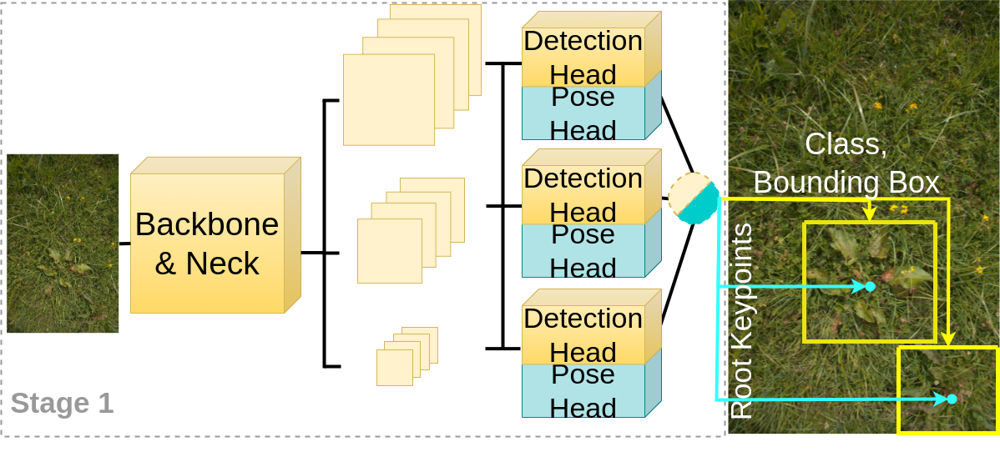

# YOLO-Pose-on-RumexWeeds
This is the repository of YOLO-Pose single-class implementation on RumexWeeds Dataset


# Usage
## Environment
* Python >= 3.6
* Pytorch >= 1.8.0
* Detailed requirments are shown in `requirements.txt`

## Data preparation
Please download [RumexWeeds Dataset](https://figshare.com/s/287873a5ac9297f181cc). We use \$your-data-path\$ to denote your saved data path. The original annotations are saved in xml format. We need to convert them into txt format. Please run
```
python3 convert_XML_to_COCO_in_YOLO.py --root=$your-data-path$ --target_dir='../RumexWeeds_root_YOLOtxt'
```
Please also change the train/val/test dataset information in `DataInfo.yaml`

## Training and Testing
### Training on RumexWeeds dataset
```
python3 train.py --batch-size=14 --optimizer='Adam' --weights='./yolov5m.pt' --hyp='./hyps/hyp.scratch-high.yaml' --img=640 --epochs=100 --cos-lr --oks_sigma=0.2
```

### Testing on RumenWeeds dataset
please put the trained model named `best.pt` under `./saved_model` folder
```
python3 Test.py --oks_sigma=0.2
```
You can download trained model for YOLO-Pose via https://drive.google.com/drive/folders/144TTUVqCjLRmz0EYV64TO4iKM7Ny3hBi?usp=share_link

# Results Visualization
`To Do`

# Code References
* [YOLOv5 offical repository](https://github.com/ultralytics/yolov5)
* [YOLO-Pose offical repository](https://github.com/TexasInstruments/edgeai-yolov5)
